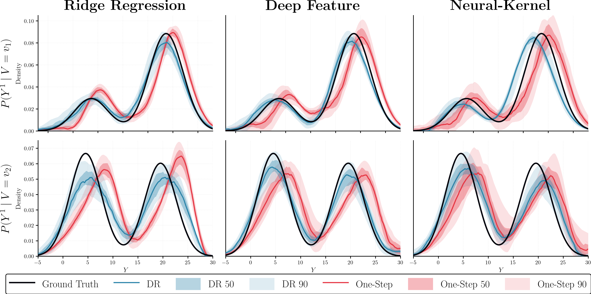

# Conditional Counterfactual Mean Embeddings (CCME)

Official JAX implementation for doubly robust estimation of conditional counterfactual densities as described in the paper "Conditional Counterfactual Mean Embeddings: Doubly Robust Estimation and Learning Rates".

[Example on IHDP dataset in Colab](https://colab.research.google.com/github/donlap/Conditional-Counterfactual-Mean-Embeddings/blob/main/demo_notebook.ipynb#scrollTo=KdlOuMvejJk5)

## Overview

This repository provides three practical estimators for conditional counterfactual densities (CCD):
- **Ridge Regression (`ridge`)**: Kernel ridge regression estimator
- **Deep Feature (`df`)**: Neural network-based feature map estimator
- **Neural-Kernel (`nk`)**: Grid-based neural network estimator

Each estimator come with four modes: Doubly Robust (`dr`), Inverse Propensity Weighting (`ipw`), Plug-In (`pi`) and One-Step (`onestep`). $K$-fold cross-fitting is also supported.

Here's a comparison between the Doubly Robust and One-Step modes of the Deep Feature estimator on a bimodal CCD.  



## Installation

### Option 1: Using `pip`

```bash
# Clone the repository
git clone https://github.com/yourusername/ccme.git
cd ccme

# Create virtual environment
python3.10 -m venv venv
source venv/bin/activate  # On Windows: venv\Scripts\activate

# Install dependencies
pip install -e .
```

### Option 2: Using `uv`

[`uv`](https://github.com/astral-sh/uv) is a fast Python package installer and resolver.

```bash
# Clone the repository
git clone https://github.com/yourusername/ccme.git
cd ccme

# Create virtual environment and install dependencies
uv venv --python 3.10.6
source .venv/bin/activate  # On Windows: .venv\Scripts\activate
uv pip install -e .
```


## Quick Start: Interactive Demo

The easiest way to get started is with the Jupyter notebook:

```bash
jupyter notebook demo_notebook.ipynb
```

## Reproducing Paper Results

The paper presents three main experiments:

### 1. Experiment 1: Robustness Analysis

```bash
# Run robustness experiment for all methods and modes
python experiment_robustness.py
```

**Generate the plot:**
```bash
python plot_mses.py
# Output: fig_mses.pdf
```

### 2. Experiment 2: Qualitative Assessment (Density Plots)

Visualizes estimated densities for two covariate profiles across 30 runs.

```bash
# Run qualitative experiment for all methods
python experiment_densities.py
```

**Generate the density plot:**
```bash
python plot_densities.py
# Output: fig_densities.pdf
```

### 3. Experiment 3: Semi-Synthetic Experiment on Selective Denoising of MNIST data

```bash
# Run MNIST experiment
python experiment_mnist.py
```

**Generate the MNIST plot:**
```bash
python plot_mnist.py
# Output: fig_mnist.pdf
```

## Using the `CCDEstimator` Class

### Basic Usage

```python
from ccme import CCDEstimator
from utils import generate_data
from omegaconf import OmegaConf
import numpy as np

# 1. Load configuration
cfg = OmegaConf.load("configs/simulation/method/nk.yaml")

# 2. Generate or load your data
X, Y, A = generate_data(n_samples=10000, seed=42)
# X: (N, d_x) covariates
# Y: (N, d_y) outcomes
# A: (N,) binary treatment (0 or 1)

# 3. Define conditioning variables (subset of covariates)
V = X[:, :5]  # Use first 5 dimensions for conditioning

# 4. Initialize and fit estimator
estimator = CCDEstimator(cfg)
estimator.fit(X=X, V=V, Y=Y, A=A)

# 5. Predict counterfactual densities
V_test = np.array([[1.0, 0.5, -0.5, 1.5, 0.0]])  # Test points
Y_grid = np.linspace(-10, 40, 1000)[:, None]      # Grid for density

pdf_est = estimator.predict(V_eval=V_test, Y_grid=Y_grid)
# pdf_est: (1, 1000) - density values at each Y_grid point
```

### Using Configuration Files

The recommended way to use `CCDEstimator` is through Hydra configuration files.

**Example: Custom configuration file `my_config.yaml`**

```yaml
# my_config.yaml
method: nk        # Options: nk, df, ridge
mode: dr          # Options: dr, onestep, ipw, pi
seed: 42
verbose: True
n_folds: null     # Cross-fitting folds (null for 50-50 split, >= 2 for K-fold)

model:
    output_dim: 20              # Number of grid points (nk) or features (df)
    hidden_dim: [20, 20]     # Neural network architecture
    sigma_init: 2.0          # Kernel bandwidth initialization
    lamb: null               # Regularization (null for nk, float for df/ridge)
    learn_sigma: False       # Whether to learn kernel bandwidth

propensity_score_model:
    _target_: sklearn.ensemble.RandomForestClassifier
    max_depth: 4

train:
    lr_or: 4e-2              # Learning rate for stage 1 (nuisance model)
    lr_fi: 4e-2              # Learning rate for stage 2 (final model)
    batch_size_or: 10000     # Batch size for stage 1
    batch_size_fi: 10000     # Batch size for stage 2
    epoch_or: 16000          # Epochs for stage 1
    epoch_fi: 500            # Epochs for stage 2
    valid_size_or: null      # Validation size for stage 1 (null, int, or fraction)
    valid_size_fi: null      # Validation size for stage 2 (null, int, or fraction)
    patience_or: null        # Early stopping patience for stage 1
    patience_fi: null        # Early stopping patience for stage 2

test:
    num_bin: 1000
```

**Use with Hydra:**

```python
import hydra
from omegaconf import DictConfig
from ccme import CCDEstimator

@hydra.main(config_path=".", config_name="my_config", version_base=None)
def main(cfg: DictConfig):
    estimator = CCDEstimator(cfg)
    # ... rest of your code

if __name__ == "__main__":
    main()
```

Or override from command line:
```bash
python your_script.py method=df mode=dr train.lr_or=1e-2 train.epoch_or=10000
```

## Citation

If you use this code in your research, please cite:

```bibtex
@article{ccme2026,
  title={Conditional Counterfactual Mean Embeddings: Doubly Robust Estimation and Learning Rates},
  author={Thatchanon Anancharoenkij and Donlapark Ponnoprat},
  journal={arXiv preprint arXiv:XXXX.XXXXX},
  year={2026}
}
```
```bibtex
@inproceedings{deepfeature2021,
    author = {Liyuan Xu and Yutian Chen and Siddarth Srinivasan and Nando de
              Freitas and Arnaud Doucet and Arthur Gretton},
    title = {Learning Deep Features in Instrumental Variable Regression},
    booktitle = {9th International Conference on Learning Representations, {ICLR
                 } 2021, Virtual Event, Austria, May 3-7, 2021},
    publisher = {OpenReview.net},
    year = {2021},
    url = {https://openreview.net/forum?id=sy4Kg\_ZQmS7},
}
```
```bibtex
@inproceedings{neuralkernel2024,
    author = {Eiki Shimizu and Kenji Fukumizu and Dino Sejdinovic},
    title = {Neural-Kernel Conditional Mean Embeddings},
    booktitle = {Forty-first International Conference on Machine Learning, {ICML
                 } 2024, Vienna, Austria, July 21-27, 2024},
    publisher = {OpenReview.net},
    year = {2024},
    url = {https://openreview.net/forum?id=0wso32h0jc},
}
```
